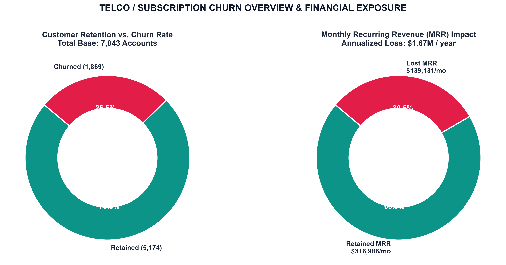
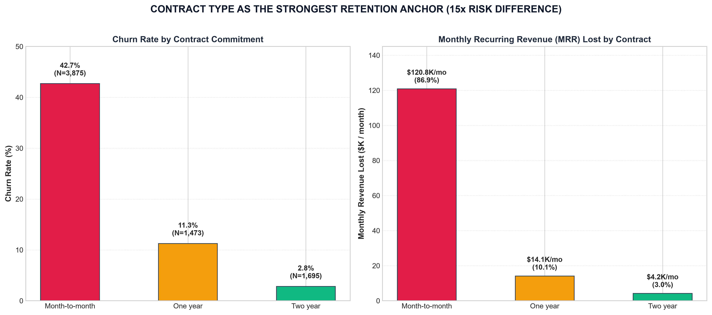
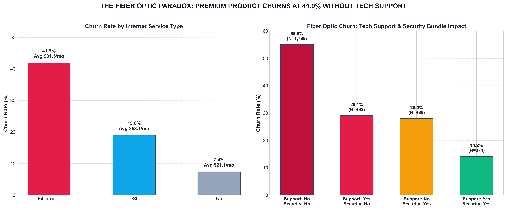
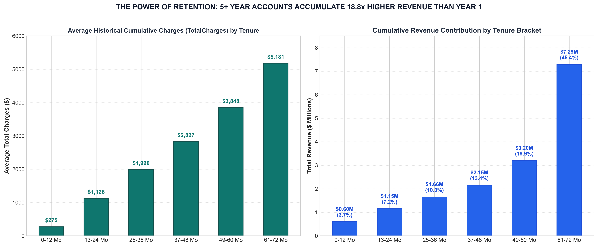
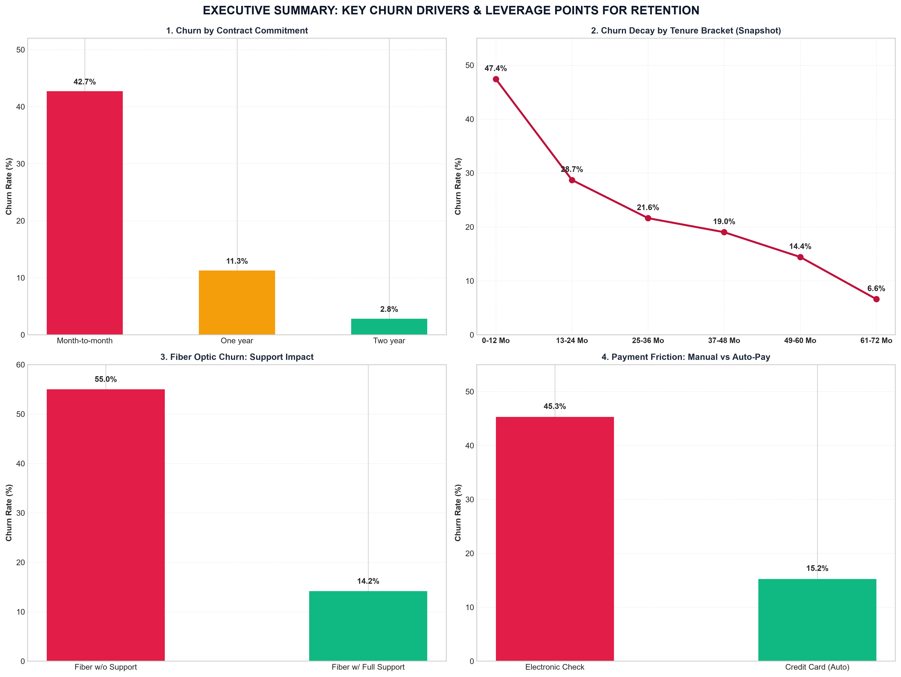
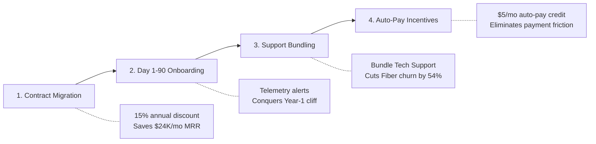

# 📊 Future Interns - Task 2: Customer Retention & Churn Analysis

> **Internship Task 2 Deliverable for Future Interns (Data Science & Analytics 2026)**  
> An end-to-end customer retention and subscription churn analysis across **7,043 subscriber accounts** ($456.1K baseline MRR) diagnosing churn drivers, cross-sectional tenure retention patterns, and delivering an executive retention playbook to preserve recurring revenue.

---

## 📑 Core Task 2 Deliverables

| Deliverable | File / Path | Key Details |
|---|---|---|
| **Executive Excel Dashboard** | **[`Customer_Retention_Dashboard.xlsx`](Customer_Retention_Dashboard.xlsx)** | Formatted 4-tab workbook featuring symmetrical KPI cards, native Excel charts, tenure bracket retention matrix, customer churn risk scoring, and 7,043 cleaned records with autofilters. |
| **Business Analysis & Advisory Report** | **[`retention_analysis_report.md`](retention_analysis_report.md)** | Strategic advisory report for founders and product teams detailing tenure-based attrition decay, root-cause drivers, cumulative spend economics, and a 30-60-90 day retention roadmap. |
| **Jupyter Analytics Notebook** | **[`customer_retention_and_churn_analysis.ipynb`](customer_retention_and_churn_analysis.ipynb)** | End-to-end reproducible Python notebook covering data cleaning, EDA, cross-sectional tenure bracket curves, risk modeling, and financial simulations. |
| **Cleaned Customer Dataset** | **[`data/telco_customer_churn_cleaned.csv`](data/telco_customer_churn_cleaned.csv)** | Preprocessed dataset with whitespace handling, binary churn flags, tenure cohorts, and predictive churn risk tiers. |
| **High-Resolution Visualizations** | **[`visualizations/retention/`](visualizations/retention/)** | 7 publication-grade 300 DPI visualizations covering churn overview, cohort decay, contract risk, support paradox, payment friction, and cumulative spend progression. |
| **LinkedIn Showcase Post** | **[`task2_linkedin_post.txt`](task2_linkedin_post.txt)** | Ready-to-publish professional LinkedIn post summarizing problem scope, insights, and technical tools. |

---

## 🎯 Executive KPI Scorecard

| Metric | Portfolio Value | Strategic Business Context |
|---|---|---|
| **Total Customer Base** | **7,043 Accounts** | 5,174 Retained (73.5%) vs. 1,869 Churned (26.5%) |
| **Overall Churn Rate** | **26.54%** | Observed snapshot churn across all records (subscription reference target: < 5–8%; dataset does not establish a 12-month annual period) |
| **Monthly Revenue Lost (MRR)** | **$139,130.85 / mo** | 30.5% of total portfolio recurring revenue ($456.1K baseline MRR) |
| **Annualized Run-Rate Loss** | **$1,669,570.20 / yr** | High revenue leakage eroding customer acquisition ROI |
| **Year-1 Retention Rate** | **52.56%** | **47.4% churn in months 0–12** (The Onboarding Cliff) |
| **Observed Mean Tenure** | **32.4 Months** | Snapshot subscriber base (right-censored) |
| **Cumulative Spend (TotalCharges)** | **$275.23 (Yr 1) -> $5,180.67 (Yr 6)** | Accounts in mature 61–72 Mo bracket accumulate **18.8x higher total charges** than 0–12 Mo bracket (across all accounts in bracket) |

> **📌 Methodological Note: Cross-Sectional Snapshot vs. Longitudinal Cohort Tracking**  
> This dataset represents a **cross-sectional snapshot** of 7,043 customer accounts observed at a single point in time, with tenure ranging from 0 to 72 months. Grouping accounts into 12-month tenure lifecycle brackets (`0-12 Mo`, `13-24 Mo`, etc.) provides a cross-sectional proxy for tenure-related attrition propensity.  
> - **Snapshot Churn vs. Annual Benchmark:** The 26.54% churn rate is the proportion of churned accounts within the cross-sectional dataset across heterogeneous observation periods. Because the dataset does not establish a uniform 12-month observation window, subscription benchmark comparisons (e.g. < 5–8% annual SaaS churn) serve as illustrative reference targets rather than an annualized measurement comparison.  
> - **Right-Censored Active Accounts:** For currently retained subscribers, tenure is right-censored because their subscriptions are ongoing. The 32.4-month average represents the *mean observed tenure* of accounts in this snapshot rather than completed actuarial customer lifetimes.  
> - **Tenure Bracket Spend Composition:** Cumulative spend comparisons across tenure brackets ($275.23 in Months 0–12 vs. $5,180.67 in Months 61–72) reflect mean TotalCharges accumulated by *all accounts (both retained and churned)* observed within each bracket, illustrating tenure-driven billing accumulation rather than tracking only active survivors.

---

## 📈 Visual Analytics & Strategic Findings

### 1. Portfolio Churn Overview & Revenue Exposure

- **Topline Exposure:** While 26.5% of subscriber accounts churned, they accounted for **30.5% of monthly recurring revenue** ($139.1K/mo), indicating that churn is skewed toward higher-priced accounts.
- **Annualized Impact:** Churn accounts for **$1.67 Million per year** in lost recurring cash flow.

---

### 2. The Onboarding Cliff (Tenure Bracket Retention & Churn Decay)

- **The Month 0–12 Cliff:** **55.5% of all churn (1,037 accounts)** occurs in the first 12 months.
- **Attrition Stabilization:** For accounts active past Month 24, snapshot churn drops to **21.6%**, and drops further to **6.6%** for Month 61–72 accounts. Proactive onboarding in Days 1–90 is the highest leverage retention initiative.

---

### 3. Contract Commitment as the Core Retention Anchor

- **Month-to-Month:** 42.7% churn rate, accounting for **86.9% ($120.8K/mo) of all lost MRR**.
- **One-Year Contract:** 11.3% churn rate (3.8x lower risk).
- **Two-Year Contract:** 2.8% churn rate (15.1x lower risk).
- **Takeaway:** Converting 20% of Month-to-Month accounts to 1-Year plans saves ~$24K/month in revenue.

---

### 4. Product Quality & The Fiber Optic Support Paradox

- **The Paradox:** Premium Fiber Optic ($91.50/mo avg) churns at **41.9%** vs. **19.0% for DSL**.
- **The Root Cause:** Fiber Optic customers **without Tech Support churn at 49.4%**, while those with Tech Support churn at **22.6%** (a 54% reduction).
- **Takeaway:** Stop selling unbundled Fiber Optic; bundle 24/7 Tech Support and Online Security directly into base pricing.

---

### 5. Payment Channel Friction & Involuntary Churn

- **Electronic Check:** Churns at **45.3%** ($76.26/mo avg), representing high monthly friction and involuntary lapses.
- **Auto-Pay:** Credit Card Auto-Pay (15.2% churn) and Bank Transfer Auto-Pay (16.7% churn) retain **84-85% of accounts**.
- **Takeaway:** Provide a $5/month statement credit for enrolling in Auto-Pay.

---

### 6. Historical Cumulative Spend Progression by Tenure Bracket

- **Cumulative Revenue Expansion:** Average observed cumulative charges (`TotalCharges`) expand from **$275.23** in Year 1 to **$5,180.67** in Year 6 (an 18.8x multiple in observed cumulative spend to date).
- **Cumulative Contribution:** The 61–72 month cohort accounts for **$7.29M (45.4%) of all historical revenue to date**, confirming that retention compounds customer value.

---

### 7. Executive Retention Dashboard Summary

---

## 🚀 4-Pillar Retention Playbook & Action Plan

### Financial ROI Sensitivity Model

| Churn Reduction Target | Monthly Churned Accounts Saved | Monthly Recurring Revenue Preserved | Annual Revenue Preserved (ARR) | Valuation Added (8x ARR Multiple) |
|---|---|---|---|---|
| **5% Reduction** | 93 accounts / mo | **$6,956.54 / mo** | **$83,478.51 / yr** | **+$667,828** |
| **10% Reduction** | 186 accounts / mo | **$13,913.09 / mo** | **$166,957.02 / yr** | **+$1,335,656** |
| **15% Reduction** | 280 accounts / mo | **$20,869.63 / mo** | **$250,435.53 / yr** | **+$2,003,484** |
| **20% Reduction** | 373 accounts / mo | **$27,826.17 / mo** | **$333,914.04 / yr** | **+$2,671,312** |

---

## 💻 Tech Stack & Methodologies
- **Microsoft Excel:** Executive dashboard design, KPI formatting, native Excel Bar & Column charts, cohort tables, and risk segmentation.
- **Python 3.12:** Data hygiene, type conversion, pandas grouping, numpy aggregation, and statistical testing.
- **Matplotlib & Seaborn:** Publication-quality 300 DPI visualization exports with unified design aesthetics.
- **Business Strategy:** SaaS retention economics, tenure bracket retention decay, cumulative spend modeling, and sensitivity analysis.

---
*Developed as part of the Future Interns Data Science & Analytics Program.*
