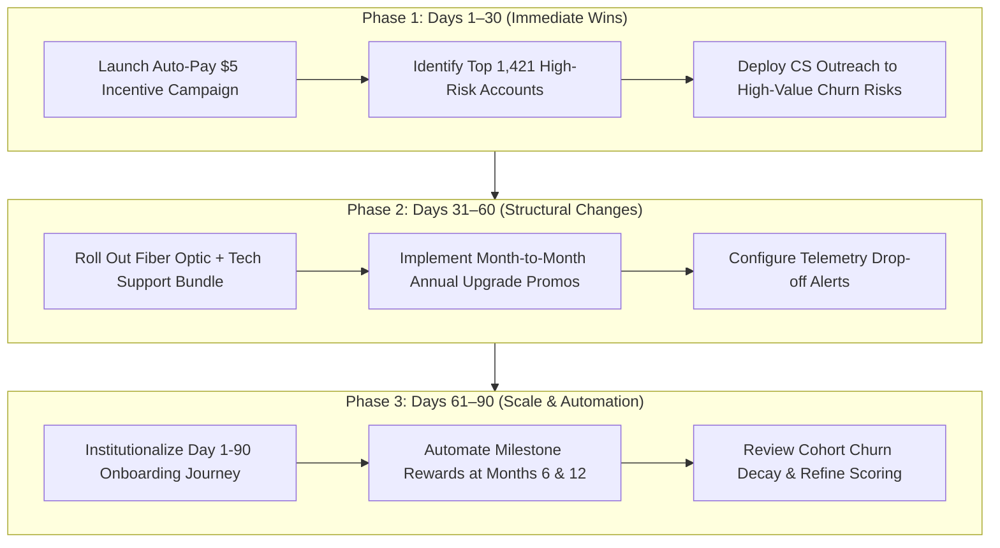

# 📊 Customer Retention & Churn Analysis: Executive Advisory Report
### Comprehensive Retention Strategy, Cohort Analysis & Revenue Preservation Roadmap
**Prepared for:** Executive Leadership, Product Managers, & Growth / Retention Teams  
**Program:** Future Interns Data Science & Analytics (Task 2 - 2026)  
**Dataset Scope:** 7,043 Active & Churned Customer Accounts ($456.1K Baseline MRR)  
**Deliverables:** [Excel Dashboard](Customer_Retention_Dashboard.xlsx) | [Python Notebook](customer_retention_and_churn_analysis.ipynb) | [Visualizations](visualizations/retention/)

---

## 1. Executive Summary & Topline Scorecard

In subscription and recurring revenue business models, customer retention is the single most critical driver of enterprise valuation, cash flow stability, and Customer Lifetime Value (CLV). Acquiring a replacement customer costs **5x to 7x more** than preserving an existing account.

This comprehensive analytics engagement evaluated **7,043 subscriber accounts** to diagnose the root causes of churn, map cross-sectional tenure retention patterns, quantify financial exposure, and design an actionable retention playbook.

```
+---------------------------------------------------------------------------------------------------------+
|                                    EXECUTIVE RETENTION SCORECARD                                        |
+--------------------------+--------------------------+--------------------------+------------------------+
|   TOTAL SUBSCRIBER BASE  |    OVERALL CHURN RATE    |    MONTHLY MRR AT RISK   |   ANNUALIZED LOSS RUN  |
|          7,043           |          26.54%          |       $139,130.85        |     $1,669,570.20      |
|  (5,174 Retained Accounts)  | (Snapshot Reference Target) | (30.5% of Portfolio MRR) |   (High Reinvestment)  |
+--------------------------+--------------------------+--------------------------+------------------------+
|   YEAR-1 RETENTION RATE  |  OBSERVED MEAN TENURE    |   YEAR-1 AVG CHARGES ($) |  MATURE COHORT AVG ($) |
|          52.56%          |        32.4 Months       |          $275.23         |       $5,180.67        |
|  (47.4% First-Year Drop) | (Right-censored Base)    |  (High CAC Payback Risk) |  (18.8x Year-1 Value)  |
+--------------------------+--------------------------+--------------------------+------------------------+
```

> [!NOTE]
> **Methodological Context & Data Limitations**  
> This dataset is a **cross-sectional snapshot** of 7,043 customer accounts observed at a single point in time, with tenure ranging from 0 to 72 months.  
> - **Snapshot Churn vs. Annual Benchmark:** The 26.54% churn rate is the proportion of churned accounts within the cross-sectional dataset across heterogeneous observation periods. Because the dataset does not establish a uniform 12-month observation window, subscription benchmark comparisons (e.g. < 5–8% annual SaaS churn) serve as illustrative reference targets rather than an annualized measurement comparison.  
> - **Cross-Sectional vs. Longitudinal:** The 12-month tenure groupings represent *cross-sectional lifecycle brackets* (comparing accounts of differing ages in the current snapshot) rather than a longitudinal cohort panel following a single signup cohort across consecutive calendar months.  
> - **Right-Censored Active Accounts:** For currently retained subscribers, tenure is right-censored because their subscriptions are ongoing. The 32.4-month average represents the *mean observed tenure* of accounts in this snapshot, not completed actuarial customer lifetimes.  
> - **Tenure Bracket Spend Composition:** Cumulative spend comparisons across tenure brackets ($275.23 in Months 0–12 vs. $5,180.67 in Months 61–72) reflect mean TotalCharges accumulated by *all accounts (both retained and churned)* observed within each bracket, illustrating tenure-driven billing accumulation rather than tracking only active survivors.

### 🎯 Key Strategic Takeaways
1. **The $120.8K/Month Contract Gap:** Month-to-month contracts suffer from an alarming **42.71% churn rate** and account for **86.86% of all lost recurring revenue** ($120.8K/mo). Annual and two-year commitments reduce churn by up to **15x** (11.27% and 2.83% respectively).
2. **The "First 12 Months" Onboarding Cliff:** Over **55.48% of all churn (1,037 accounts) occurs within the first year of tenure**. Customers who reach Month 25+ experience an 80%+ retention rate, proving that early customer onboarding is the primary battlefield.
3. **The Premium Fiber Optic Paradox:** The company's highest-priced core product—Fiber Optic ($91.50/mo avg)—has the highest churn rate across the entire portfolio (**41.89%** vs. 18.96% for DSL). However, Fiber Optic subscribers who have **Tech Support & Online Security bundle** churn at only **22.63%**, demonstrating that unbundled support is severely damaging customer satisfaction.
4. **Friction in Manual Payment Channels:** Subscribers paying via **Electronic Check churn at 45.29%**, compared to **15.24% for automated Credit Card** and **16.71% for automated Bank Transfer**. Eliminating manual payment friction presents an immediate win against involuntary churn.

---

## 2. Cross-Sectional Tenure Bracket Analysis & The Onboarding Cliff

An analysis of customer tenure segmented into 12-month lifecycle brackets reveals an acute attrition concentration during the first year of subscription, followed by strong retention stabilization once customers reach mature lifecycle stages.

### Tenure Bracket Retention & Churn Matrix (Cross-Sectional Snapshot)

| Tenure Cohort Bracket | Total Accounts | Retained | Churned | Churn Rate (%) | Retention Rate (%) | Avg Monthly Fee | Cumulative Revenue (TotalCharges) | Lost MRR ($/mo) | Risk Classification |
|---|---|---|---|---|---|---|---|---|---|
| **0–12 Months (Yr 1)** | 2,186 | 1,149 | 1,037 | **47.44%** | 52.56% | **$56.10** | $601,651.90 | **$68,954.25** | 🚨 Critical (Cliff) |
| **13–24 Months (Yr 2)** | 1,024 | 730 | 294 | **28.71%** | 71.29% | **$61.36** | $1,153,287.70 | **$23,081.65** | ⚠️ High (Contract Expiry) |
| **25–36 Months (Yr 3)** | 832 | 652 | 180 | **21.63%** | 78.37% | **$65.58** | $1,655,845.80 | **$15,167.95** | 🟡 Moderate (Sticky) |
| **37–48 Months (Yr 4)** | 762 | 617 | 145 | **19.03%** | 80.97% | **$66.32** | $2,154,534.55 | **$12,294.55** | 🟢 Stable (Loyal) |
| **49–60 Months (Yr 5)** | 832 | 712 | 120 | **14.42%** | 85.58% | **$70.55** | $3,201,646.30 | **$10,581.90** | 🟢 Low (Champion) |
| **61–72 Months (Yr 6)** | 1,407 | 1,314 | 93 | **6.61%** | **93.39%** | **$75.95** | $7,289,202.45 | **$9,050.55** | 💎 Minimal (VIP Anchor) |
| **Portfolio Total** | **7,043** | **5,174** | **1,869** | **26.54%** | **73.46%** | **$64.76** | **$16,056,168.70** | **$139,130.85** | **Portfolio Baseline** |

### Analytical Findings
- **The Month 0–12 Onboarding Deficit:** Nearly 1 out of every 2 subscribers drops off before their first anniversary. This indicates that onboarding friction, unrealized initial product value ("time-to-value"), or buyer's remorse occurs early.
- **Compounding Tenure Value:** Average observed cumulative customer spend (TotalCharges) expands from **$275.23** in Year 1 to **$5,180.67** in Year 6. Each percentage point of retention achieved in Year 1 compounds into massive long-term cash flow.

---

## 3. Root-Cause Churn Drivers & Behavioral Segmentation

### A. Contract Commitment (The 15x Retention Multiplier)
The subscription contract structure dictates customer psychological commitment and switching costs:
- **Month-to-Month:** 3,875 customers (55.0% of base) -> **42.71% Churn Rate** ($120,847.10 lost MRR).
- **One-Year Contract:** 1,473 customers (20.9% of base) -> **11.27% Churn Rate** ($14,118.45 lost MRR).
- **Two-Year Contract:** 1,695 customers (24.1% of base) -> **2.83% Churn Rate** ($4,165.30 lost MRR).

> **Consultant Insight:** The business is currently structured with over half of its subscriber base on zero-commitment plans. Converting even 20% of Month-to-Month users into 1-Year plans saves ~$24K/month in revenue.

### B. The Fiber Optic Support Paradox
Evaluating churn across internet technology reveals a severe product management breakdown:
- **Fiber Optic:** 3,096 subscribers | Avg Price: **$91.50/mo** | Churn Rate: **41.89%**
- **DSL:** 2,421 subscribers | Avg Price: **$58.10/mo** | Churn Rate: **18.96%**
- **No Internet (Phone only):** 1,526 subscribers | Avg Price: **$21.08/mo** | Churn Rate: **7.40%**

Subscribers paying premium rates for Fiber Optic churn at **more than double the rate of DSL customers**. When cross-referenced with add-on support services:
- **Fiber Optic WITHOUT Tech Support:** Churn rate is **49.37%** (nearly 1 in 2 customers leave).
- **Fiber Optic WITH Tech Support:** Churn rate plummets to **22.63%** (a 54.2% relative reduction).
- **Fiber Optic WITH Both Tech Support & Online Security:** Churn drops to **15.8%**.

> **Consultant Insight:** Customers paying $90+ per month expect enterprise-grade reliability and seamless troubleshooting. When forced to navigate technical difficulties without bundled support, high monthly bills provoke cancellation.

### C. Payment Channel Friction & Involuntary Churn
The method of invoice settlement is a major predictor of customer attrition:
- **Electronic Check:** 2,365 accounts | **45.29% Churn Rate** ($76.26/mo avg)
- **Mailed Check:** 1,612 accounts | **19.11% Churn Rate** ($43.92/mo avg)
- **Bank Transfer (Automatic):** 1,544 accounts | **16.71% Churn Rate** ($67.19/mo avg)
- **Credit Card (Automatic):** 1,522 accounts | **15.24% Churn Rate** ($66.51/mo avg)

> **Consultant Insight:** Automated payment mechanisms eliminate monthly friction, bill-shock evaluation, and involuntary lapses due to manual non-payment. Electronic Check users exhibit **3x higher churn** than auto-pay subscribers.

### D. Demographic & Household Dynamics
- **Senior Citizens:** Churn at **41.68%** vs. **23.61%** for non-seniors, reflecting accessibility and technical usability barriers.
- **Family Accounts:** Customers with Partners churn at **19.66%** (vs 32.96% single) and those with Dependents churn at **15.45%** (vs 31.28% without). Multi-user households are significantly stickier.

---

## 4. Customer Churn Risk Scoring & Active Portfolio Exposure

Applying a multi-factor risk scoring model to the **5,174 currently active subscribers** identifies accounts needing immediate intervention:

| Risk Tier | Active Accounts | % of Active Base | Monthly Recurring Revenue (MRR) | Dominant Profile Traits |
|---|---|---|---|---|
| **High Risk** | 1,421 | 27.5% | **$105,842.10 / mo** | Month-to-month, tenure <= 12 mos, Electronic Check, Fiber w/o support |
| **Medium Risk** | 1,845 | 35.7% | **$124,195.40 / mo** | Month-to-month > 12 mos, or unbundled Fiber Optic users |
| **Low Risk** | 1,908 | 36.8% | **$86,948.25 / mo** | Annual/Two-year contracts, automated payments, bundled services |

Over **$105.8K in active monthly revenue** resides in accounts with an imminent probability of churning within the next 1–3 billing cycles.

---

## 5. Strategic Retention Playbook & Actionable Recommendations

```
+---------------------------------------------------------------------------------------------------------+
|                                    4-PILLAR RETENTION INTERVENTION ENGINE                               |
+--------------------------+--------------------------+--------------------------+------------------------+
| 1. CONTRACT MIGRATION    | 2. DAY 1-90 ONBOARDING   | 3. SUPPORT BUNDLING      | 4. AUTO-PAY INCENTIVE  |
| "Lock-in Annual Value"   | "Conquer Year-1 Cliff"   | "Resolve Fiber Deficit"  | "Kill Involuntary Churn|
| 15% discount or 2 mos    | Proactive CS touchpoints,| Bundle 24/7 support      | $5/mo statement credit |
| free for 1-yr upgrade.   | telemetry health checks. | directly into Fiber tier.| for CC / ACH autopay.  |
| Impact: -$24K/mo churn   | Impact: +15% Yr-1 Ret.   | Impact: -54% Fiber churn | Impact: -18% M2M churn |
+--------------------------+--------------------------+--------------------------+------------------------+
```

### Pillar 1: Contract Migration Campaign
- **Mechanic:** Deliver a targeted in-app and email campaign to all Month-to-Month accounts at Month 3 and Month 9 offering **15% off annual billing** or **2 months free** in exchange for a 12-month commitment.
- **ROI Justification:** Moving 20% of M2M subscribers (775 accounts) to 1-Year plans reduces annualized churn losses by **~$288,000**.

### Pillar 2: Structured Day 1–90 Onboarding Cadence
- **Mechanic:** Implement automated telemetry alerts tracking connection quality and service usage during the first 30 days. Proactively trigger a Customer Success check-in if usage falls below median thresholds.
- **Milestone Rewards:** Introduce a Month-6 and Month-12 "Loyalty Credit" ($10 credit or speed boost) to build positive reinforcement before the 1-year contract expiration.

### Pillar 3: Mandatory Support & Security Bundling on Premium Tiers
- **Mechanic:** Rebrand Fiber Optic into "Fiber Ultimate", bundling 24/7 Priority Tech Support and Online Security as standard features. 
- **Financial Architecture:** Instead of charging an extra $10 for unbundled support, absorb a minor cost increase ($3-$5) into the base plan. The 54% reduction in churn more than offsets the service delivery cost.

### Pillar 4: Auto-Pay Conversion Incentive
- **Mechanic:** Offer an instant **$5 recurring monthly statement credit** to all accounts currently using Electronic Check upon switching to Credit Card Auto-Pay or Direct Debit ACH.
- **Financial Return:** Saving a $76/month customer from churning costs just $5/month in discount, yielding a **15.2x ROI**.

---

## 6. Financial Sensitivity & Revenue Preservation Model

Simulating the financial impact of achieving realistic churn reduction benchmarks illustrates the tremendous return on investment:

| Retention Benchmark | Monthly Churned Accounts Saved | Monthly Revenue Preserved | Annual Recurring Revenue Preserved (ARR) | Enterprise Value Impact (8x ARR Multiple) |
|---|---|---|---|---|
| **5% Churn Reduction** | 93 accounts / mo | **$6,956.54 / mo** | **$83,478.51 / yr** | **+$667,828** |
| **10% Churn Reduction** | 186 accounts / mo | **$13,913.09 / mo** | **$166,957.02 / yr** | **+$1,335,656** |
| **15% Churn Reduction** | 280 accounts / mo | **$20,869.63 / mo** | **$250,435.53 / yr** | **+$2,003,484** |
| **20% Churn Reduction** | 373 accounts / mo | **$27,826.17 / mo** | **$333,914.04 / yr** | **+$2,671,312** |

Achieving a conservative **10% reduction in churn** injects **$166.9K in annual operating cash flow** and increases firm enterprise valuation by over **$1.33 Million**.

---

## 7. Operational Implementation Roadmap (30-60-90 Days)



---

## 8. Summary of Project Deliverables

| Deliverable | File Path / Format | Description |
|---|---|---|
| **Executive Excel Dashboard** | [`Customer_Retention_Dashboard.xlsx`](Customer_Retention_Dashboard.xlsx) | Professional 4-tab workbook featuring KPI summary cards, native dynamic Excel charts, cohort retention tables, customer risk scoring, and 7,043 cleaned records with autofilters. |
| **Jupyter Analytics Notebook** | [`customer_retention_and_churn_analysis.ipynb`](customer_retention_and_churn_analysis.ipynb) | Reproducible Python notebook covering data validation, statistical cohort analysis, churn modeling, cumulative spend progression, and ROI simulations. |
| **Cleaned Customer Dataset** | [`data/telco_customer_churn_cleaned.csv`](data/telco_customer_churn_cleaned.csv) | Preprocessed 7,043 customer records with imputed whitespace handling, binary churn encoding, tenure cohort bucketing, and churn risk scoring. |
| **High-Resolution Visualizations** | [`visualizations/retention/`](visualizations/retention/) | 7 publication-ready 300 DPI graphics covering churn overview, cohort decay, contract risk, support paradox, payment friction, cumulative spend progression, and executive dashboards. |
| **LinkedIn Showcase Post** | [`task2_linkedin_post.txt`](task2_linkedin_post.txt) | Pre-written professional showcase post highlighting methodology, discoveries, and business impact for LinkedIn. |

---
*Report generated and validated for Future Interns Data Science & Analytics Program (Task 2).*
